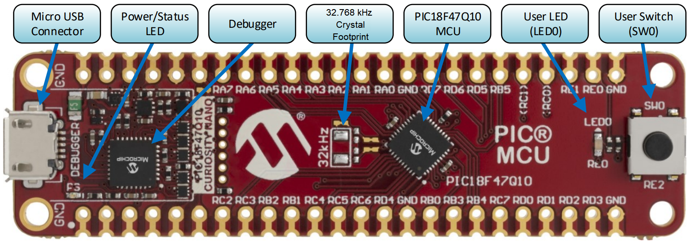
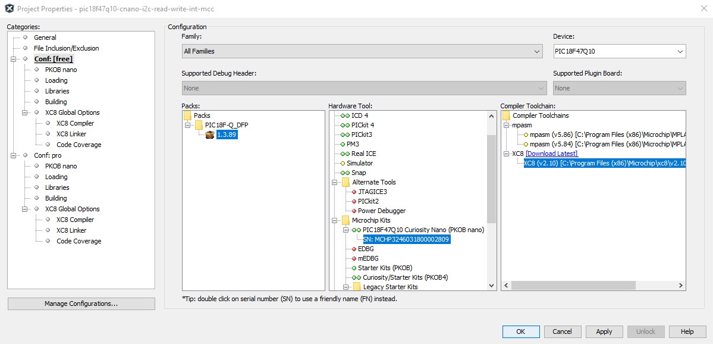
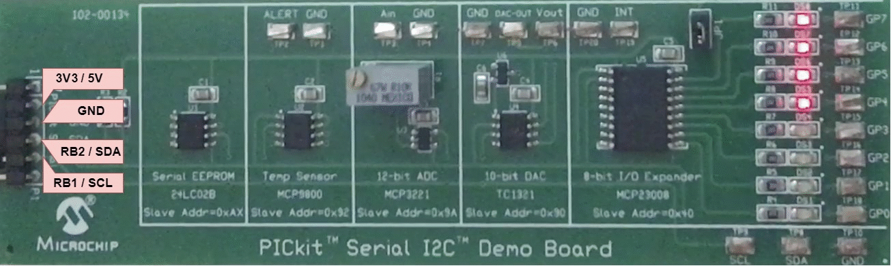

 <article class="markdown-body entry-content p-3 p-md-6" itemprop="text">

# PIC18F47Q10 I2C Master Read/Write Data Using Interrupts

## Objective
This repository contains an example of MCC-generated source code for I2C as described in [*TBxxxx - Getting Started with I2C Using MSSP on PIC18*](https://www.microchip.com/) document from Microchip.

The PIC18F47Q10 configured in I2C Master Mode using the MSSP1 peripheral and performing read and write operations with interrupts. This example will use the slave [MCP23008](https://ww1.microchip.com/downloads/en/DeviceDoc/21919e.pdf), an I/O expander, addressed in 7-bit mode.

## Related Documentation
- [TB3281 - Getting Started with I2C Using MSSP on PIC18](http://ww1.microchip.com/downloads/en/Appnotes/Getting_Started_With_I2C_Using_MSSP_on%20PIC18_90003281A.pdf)
- [PIC18-Q10 Product Family Page](https://www.microchip.com/design-centers/8-bit/pic-mcus/device-selection/pic18f-q10-product-family)
- [PIC18F47Q10 Data Sheet](http://ww1.microchip.com/downloads/en/DeviceDoc/40002043D.pdf)
- [MCP23008 - 8-Bit I/O Expander with Serial Interface](https://ww1.microchip.com/downloads/en/DeviceDoc/21919e.pdf)
- [PIC18F47Q10 Code Examples on GitHub](https://github.com/microchip-pic-avr-examples?q=pic18f47q10-cnano&type=&language=)

## Software Used
- MPLAB® X IDE 5.30 or newer [(microchip.com/mplab/mplab-x-ide)](http://www.microchip.com/mplab/mplab-x-ide)
- MPLAB® XC8 2.10 or newer [(microchip.com/mplab/compilers)](http://www.microchip.com/mplab/compilers)
- MPLAB® Code Configurator (MCC) 3.95.0 or newer [(microchip.com/mplab/mplab-code-configurator)](https://www.microchip.com/mplab/mplab-code-configurator)
- MPLAB® Code Configurator (MCC) Device Libraries PIC10 / PIC12 / PIC16 / PIC18 MCUs 1.79.0 or newer [(microchip.com/mplab/mplab-code-configurator)](https://www.microchip.com/mplab/mplab-code-configurator)
- Microchip PIC18F-Q Series Device Support 1.3.89 or newer [(packs.download.microchip.com/)](https://packs.download.microchip.com/)

## Hardware Used

- Curiosity Nano Base for Click Boards™ [(AC164162)](https://www.microchip.com/Developmenttools/ProductDetails/AC164162)
- PIC18F47Q10 Curiosity Nano [(DM182029)](https://www.microchip.com/Developmenttools/ProductDetails/DM182029)
- PICkit™ Serial I2C™ Demo Board [(PKSERIAL-I2C1)](https://www.microchip.com/DevelopmentTools/ProductDetails/PKSERIAL-I2C1)

## Setup
The PIC18F47Q10 Curiosity Nano Development Board is used as the test platform.

 

The following configurations must be made for this project:
- Clock
	- Oscillator Select: HFINTOSC
	- HF Internal Clock: 64 MHz
	- Clock Divider: 1
- MSSP1
    - Interrupt Driven: enabled
	- Serial Protocol: I2C
    - Mode: Master
    - I2C Clock Frequency: 100000
- Watchdog Timer: disabled
- Low-voltage Programming: disabled

|Pin           | Configuration      |
| :----------: | :----------------: |
|RB1 (SCL1)    | With Pull Up       |
|RB2 (SDA1)    | With Pull Up       |

## Operation
1. Connect the board to the PC.

2. Open the *pic18f47q10-cnano-i2c-read-write-int-bare.X* project in MPLAB® X IDE.

3. Configure the project properties:
    - Right click on the project and click *Properties*
    - Select the device pack in the *Packs* tab
    - Select the *PIC18F47Q10 Curiosity Nano* (click on the SN) in the *Hardware Tool* tab
    - Select the compiler version in the *Compiler Toolchain* tab
    - Click *OK* to save the changes
    
 

4. Program the project to the board: right click on the project and click *Make and Program Device*

Demo:

 

## Summary
This project is an illustration for a basic use case based around MSSP1.